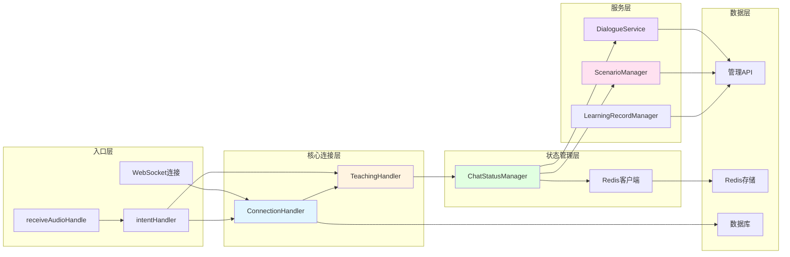
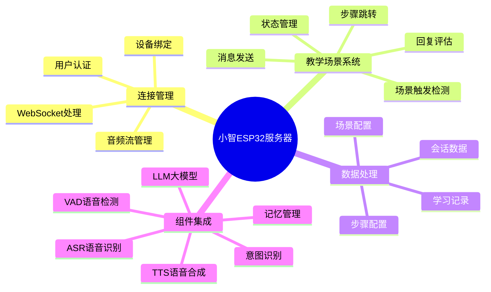
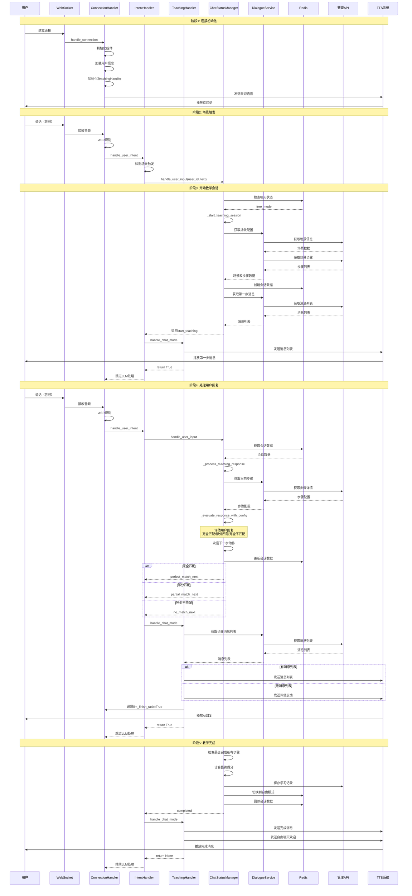
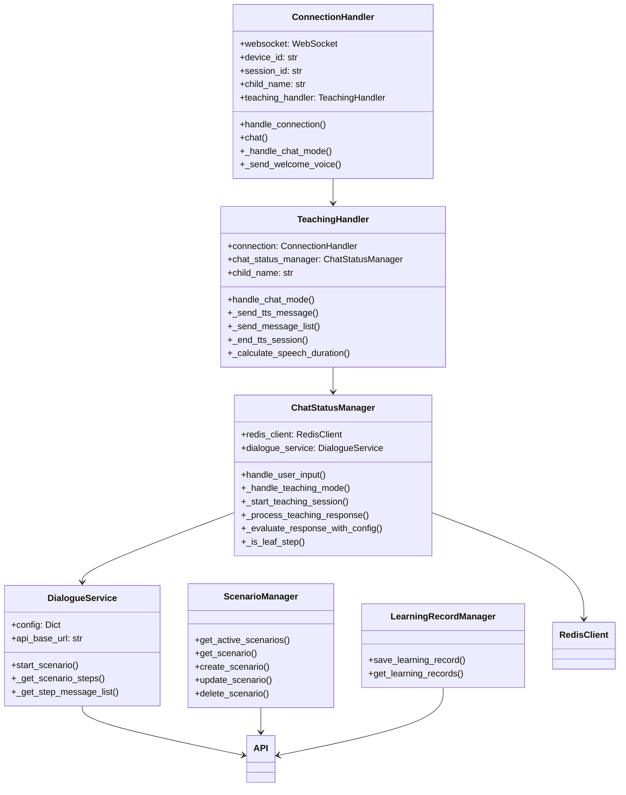
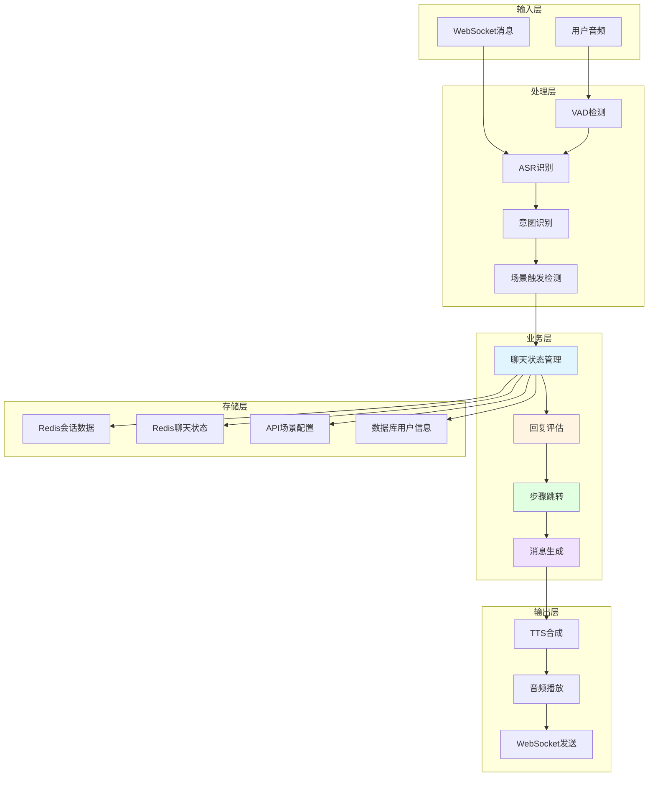
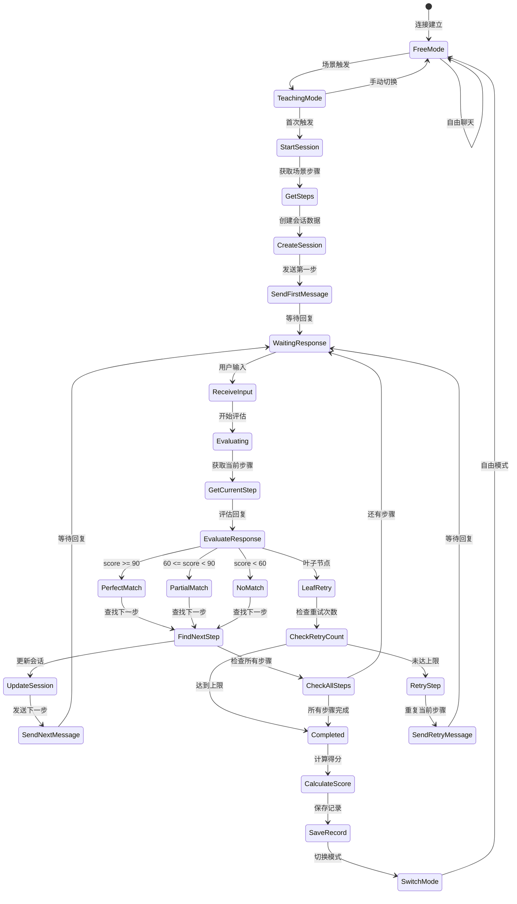

# 小智ESP32服务器 - 模块交互详细图

## 🔗 模块间交互关系图

## 📋 详细功能模块图

## 🔄 完整教学流程时序图

## 🎯 核心类结构图

## 📊 数据流架构图

## 🔀 状态转换详细图

## 🎨 功能模块职责划分

### 连接层 (ConnectionHandler)
- ✅ WebSocket连接管理
- ✅ 音频流处理
- ✅ 组件初始化
- ✅ 用户认证
- ✅ 对话历史管理

### 教学处理层 (TeachingHandler)
- ✅ 聊天模式切换处理
- ✅ TTS消息发送
- ✅ 消息列表管理
- ✅ TTS会话管理

### 状态管理层 (ChatStatusManager)
- ✅ 聊天状态管理
- ✅ 用户输入处理
- ✅ 回复评估
- ✅ 步骤跳转逻辑
- ✅ 会话数据管理

### 服务层 (DialogueService / ScenarioManager)
- ✅ API交互
- ✅ 场景配置获取
- ✅ 步骤配置获取
- ✅ 消息列表获取

### 数据层 (Redis / API / Database)
- ✅ 会话数据存储
- ✅ 聊天状态存储
- ✅ 场景配置存储
- ✅ 学习记录存储
- ✅ 用户信息存储

