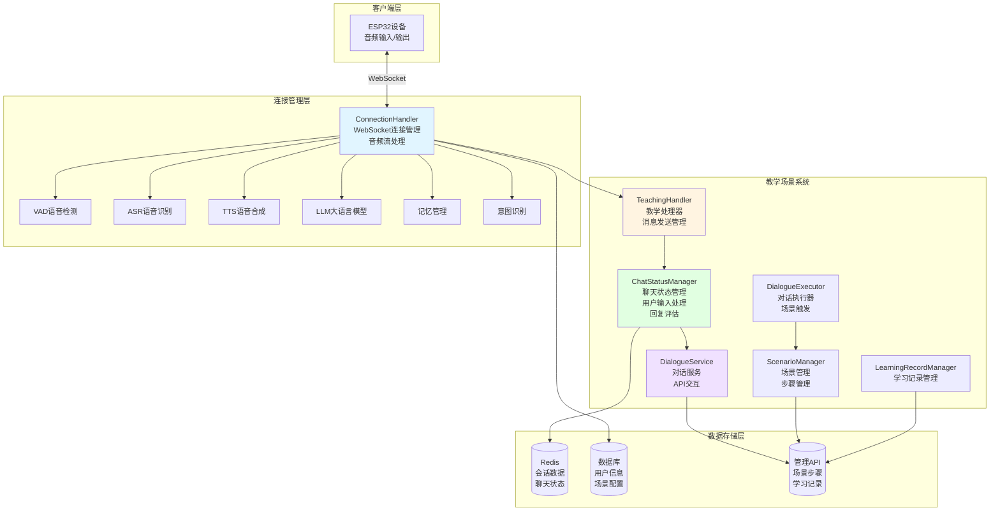
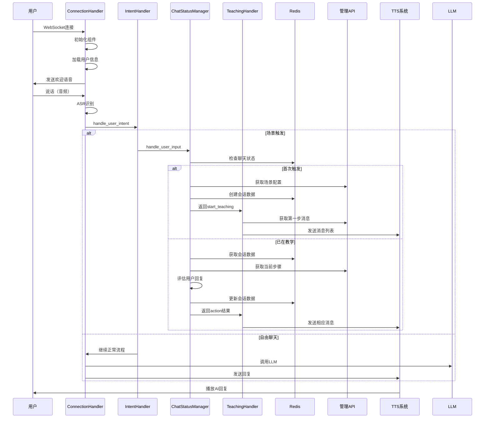
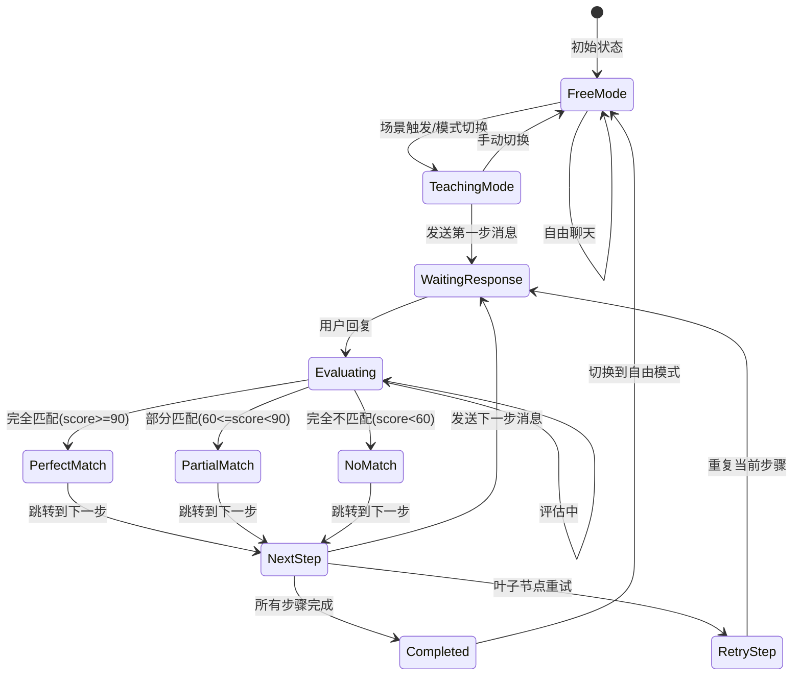

# 小智ESP32服务器 - 系统架构与功能分析

## 📐 系统整体架构图



## 🏗️ 核心模块功能分析

### 1. ConnectionHandler (连接处理器)

**文件**: `core/connection.py`

**核心职责**:
- WebSocket连接管理
- 音频流接收和发送
- 组件初始化（VAD、ASR、TTS、LLM）
- 用户认证和设备绑定
- 对话历史管理
- 与TeachingHandler集成

**关键属性**:
```python
- websocket: WebSocket连接
- device_id: 设备ID
- session_id: 会话ID
- child_name: 儿童姓名
- teaching_handler: TeachingHandler实例
- vad/asr/tts/llm: 各组件实例
- dialogue: 对话历史
- llm_finish_task: LLM任务完成标志
```

**关键方法**:
- `handle_connection()`: 处理WebSocket连接
- `chat()`: 处理聊天逻辑
- `_handle_chat_mode()`: 处理聊天模式切换
- `_send_welcome_voice()`: 发送欢迎语音

### 2. TeachingHandler (教学处理器)

**文件**: `core/scenario/teaching_handler.py`

**核心职责**:
- 处理聊天模式切换和教学模式逻辑
- 发送TTS消息（单条消息和消息列表）
- 管理TTS会话生命周期
- 与ChatStatusManager协作处理教学流程

**关键方法**:
```python
- handle_chat_mode(): 处理聊天模式切换
- _send_tts_message(): 发送单条TTS消息
- _send_message_list(): 发送消息列表
- _end_tts_session(): 结束TTS会话
- _calculate_speech_duration(): 计算语音播放时长
```

**处理流程**:
```
接收action类型
├── start_teaching → 发送第一步消息
├── perfect_match_next/partial_match_next/no_match_next → 处理步骤跳转
├── retry_current_step → 处理重试
└── completed → 处理完成，切换自由模式
```

### 3. ChatStatusManager (聊天状态管理器)

**文件**: `core/scenario/chat_status_manager.py`

**核心职责**:
- 管理用户聊天状态（teaching_mode/free_mode）
- 处理用户输入和教学回复
- 评估用户回复（完全匹配/部分匹配/完全不匹配）
- 管理教学会话数据（Redis）
- 步骤跳转逻辑（叶子节点/非叶子节点）

**关键方法**:
```python
- handle_user_input(): 处理用户输入（入口）
- _handle_teaching_mode(): 处理教学模式
- _handle_free_mode(): 处理自由模式
- _start_teaching_session(): 开始教学会话
- _process_teaching_response(): 处理教学回复
- _evaluate_response_with_config(): 评估用户回复
- _is_leaf_step(): 判断是否为叶子节点
- _get_step_max_attempts(): 获取步骤最大尝试次数
```

**评估逻辑**:
```
完全匹配（score >= 90）:
├── 包含期望短语（文字匹配）
└── 包含期望短语（拼音匹配）

部分匹配（60 <= score < 90）:
├── 包含期望关键词（文字匹配）
└── 包含期望关键词（拼音匹配）

完全不匹配（score < 60）:
└── 不包含任何期望短语或关键词
```

**步骤跳转逻辑**:
```
非叶子节点:
├── 完全匹配 → perfectMatchNextStepId
├── 部分匹配 → partialMatchNextStepId
└── 完全不匹配 → noMatchNextStepId

叶子节点:
├── 重试次数 < max_attempts → 重复当前步骤
└── 重试次数 >= max_attempts → 教学完成
```

### 4. DialogueService (对话服务)

**文件**: `core/scenario/dialogue_service.py`

**核心职责**:
- 与管理API交互
- 获取场景和步骤数据
- 创建教学会话
- 获取步骤消息列表

**关键方法**:
```python
- start_scenario(): 开始场景对话
- _get_scenario_steps(): 获取场景步骤
- _get_step_message_list(): 获取步骤消息列表
```

### 5. ScenarioManager (场景管理器)

**文件**: `core/scenario/scenario_manager.py`

**核心职责**:
- 管理学习场景（增删改查）
- 管理场景步骤（增删改查）
- 获取活跃场景列表

**关键类**:
- `ScenarioManager`: 场景管理
- `StepManager`: 步骤管理

### 6. LearningRecordManager (学习记录管理器)

**文件**: `core/scenario/learning_record_manager.py`

**核心职责**:
- 保存学习记录到API
- 管理学习会话

**关键类**:
- `LearningRecordManager`: 学习记录管理
- `LearningSession`: 学习会话管理

### 7. DialogueExecutor (对话执行器)

**文件**: `core/scenario/dialogue_executor.py`

**核心职责**:
- 执行场景对话步骤
- 场景触发检测

**关键类**:
- `DialogueStepExecutor`: 对话步骤执行器
- `ScenarioTrigger`: 场景触发器

### 8. ScenarioDialogueService (场景对话服务)

**文件**: `core/scenario/scenario_dialogue_service.py`

**核心职责**:
- 处理场景对话流程
- 管理对话会话

**关键类**:
- `ScenarioDialogueService`: 场景对话服务
- `DialogueSession`: 对话会话

## 🔄 完整数据流图



## 📊 状态管理流程图



## 🔑 关键数据结构

### Redis会话数据
```json
{
  "session_id": "teaching_{user_id}",
  "scenario_id": "scenario_123",
  "scenario_name": "场景名称",
  "current_step": 0,
  "total_steps": 5,
  "start_time": 1234567890,
  "waiting_for_response": true,
  "wait_start_time": 1234567890,
  "evaluations": [
    {
      "score": 100,
      "is_passed": true,
      "feedback": "回答完全正确！",
      "user_input": "我渴了",
      "expected_phrases": ["渴了", "我渴"],
      "expected_keywords": [],
      "max_phrase_similarity": 0
    }
  ],
  "total_user_replies": 1,
  "max_user_replies": 3,
  "warning_sent": false,
  "current_step_retry_count": 0
}
```

### 聊天状态（Redis Key）
```
setting:chat_status:{user_id} → "teaching_mode" | "free_mode"
```

## 🎯 核心功能模块

### 1. 场景触发检测
- **位置**: `dialogue_executor.py:227` (ScenarioTrigger)
- **功能**: 检测用户输入是否触发场景
- **触发条件**: 匹配场景的关键词或短语

### 2. 用户回复评估
- **位置**: `chat_status_manager.py:900` (_evaluate_response_with_config)
- **功能**: 评估用户回复是否符合期望
- **评估方式**: 文字匹配 + 拼音匹配
- **评分**: 完全匹配(100) / 部分匹配(70) / 完全不匹配(0)

### 3. 步骤跳转逻辑
- **位置**: `chat_status_manager.py:585` (_process_teaching_response)
- **功能**: 根据评估结果决定下一步
- **跳转规则**: 
  - 完全匹配 → perfectMatchNextStepId
  - 部分匹配 → partialMatchNextStepId
  - 完全不匹配 → noMatchNextStepId

### 4. TTS消息发送
- **位置**: `teaching_handler.py:331` (_send_tts_message)
- **功能**: 发送单条TTS消息
- **流程**: FIRST → MIDDLE → LAST → 等待播放完成

### 5. 消息列表发送
- **位置**: `teaching_handler.py:400` (_send_message_list)
- **功能**: 发送多条消息（步骤消息列表）
- **特点**: 每条消息独立发送，最后一条设置llm_finish_task

## 📝 模块间依赖关系

```
ConnectionHandler
├── TeachingHandler
│   └── ChatStatusManager
│       ├── DialogueService
│       │   └── API
│       ├── Redis
│       └── ScenarioManager
│           └── API
└── VAD/ASR/TTS/LLM/Memory/Intent

DialogueExecutor
├── ScenarioManager
└── LearningRecordManager

ScenarioDialogueService
├── ScenarioManager
├── StepManager
└── LearningRecordManager
```

## 🚀 系统工作流程

### 场景1: 首次触发教学场景
```
1. 用户说话 → ASR识别
2. IntentHandler检测场景触发
3. ChatStatusManager.handle_user_input
4. _start_teaching_session
   - 从API获取场景配置
   - 创建Redis会话数据
   - 获取第一步消息列表
5. TeachingHandler发送第一步消息
6. 设置等待用户响应状态
```

### 场景2: 处理用户回复
```
1. 用户说话 → ASR识别
2. ChatStatusManager.handle_user_input
3. _process_teaching_response
   - 从API获取场景步骤
   - 使用Redis中的current_step获取当前步骤
   - 评估用户回复
   - 决定下一步动作
4. 更新Redis会话数据
5. TeachingHandler根据action发送消息
6. 设置llm_finish_task = True
7. 等待TTS播放完成
```

### 场景3: 教学完成
```
1. 所有步骤完成 OR 达到最大重试次数
2. 计算最终得分
3. 保存学习记录
4. 切换到自由模式
5. 删除Redis会话数据
6. 发送完成消息和自由聊天欢迎
```

## 📌 关键设计模式

1. **状态管理模式**: 使用Redis存储聊天状态和会话数据
2. **责任链模式**: IntentHandler → ChatStatusManager → TeachingHandler
3. **策略模式**: 不同匹配类型使用不同的跳转策略
4. **观察者模式**: TTS消息发送后等待播放完成

